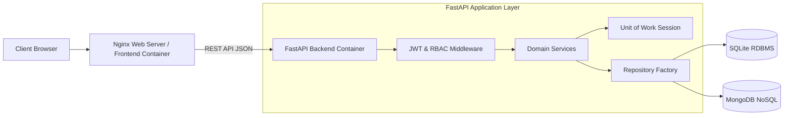

# 📦 StockHub — Enterprise Warehouse & Storage Management System

[](https://fastapi.tiangolo.com/)
[](https://react.dev/)
[](https://www.docker.com/)
[](https://nginx.org/)
[](https://tailwindcss.com/)
[](https://www.python.org/)
[](LICENSE)

**StockHub** is an enterprise-grade Warehouse Management and Storage Infrastructure Application engineered for high-concurrency operations, optimistic transactional locking, cloud-native containerization, and role-based access control (RBAC).

---

## 🌟 Key Features

### 👤 1. Customer Portal
* **Storage Space Applications**: Submit structured warehouse storage applications (`ApplyToStore`).
* **Real-time Inventory Tracker**: Monitor personal stored inventory and stock metrics.
* **Branch Capacity Explorer**: Inspect real-time cubic capacity across warehouse locations.
* **User Profile**: Account management and authentication control.

### 👷 2. Employee Workspace
* **Application Processing**: Review, approve, or reject customer storage applications (`CustomerApplications`).
* **Work Duty Assignments**: Monitor assigned storage tasks and branch duties (`Assignments`).
* **Inventory Stock Audits**: Audit real-time stock levels, record work time trackers, and generate reports.

### 👑 3. Admin Control Center
* **Full Inventory CRUD**: Bulk import items, edit stock parameters, and trigger manual adjustments (`ManageGoods`).
* **Branch Provisioning**: Manage physical warehouse branches, set branch managers, and adjust cubic space (`ManageBranches`).
* **User & Role Administration**: Manage system user accounts and inspect security audit logs (`ManageUsers`).

---

## 🏛️ System Architecture & Technology Stack

StockHub is architected according to **Clean Architecture** and 12-Factor App principles:



### Stack Components
* **Frontend**: React 18, Vite, React Router v7, Tailwind CSS, Lucide Icons, Framer Motion, Axios.
* **Backend**: Python FastAPI, Uvicorn ASGI, Pydantic v2 Settings, SQLAlchemy ORM, Passlib (bcrypt), PyJWT/Jose.
* **Containerization**: Docker multi-stage builds, Nginx Alpine, Docker Compose.
* **Databases**: SQLite (primary relational DB) and MongoDB (document activity log engine).

---

## 📚 Technical Documentation

Comprehensive architectural guides and specifications reside in [`docs/`](file:///Users/jubayerahmedsojib/Documents/GitHub/StockHub/docs/):

* 🏛️ [**Architecture & Design Patterns Guide**](file:///Users/jubayerahmedsojib/Documents/GitHub/StockHub/docs/ARCHITECTURE_AND_DESIGN_PATTERNS.md): Service Layer, Unit of Work, Repository Factory, and Dependency Injection.
* 🔒 [**Security & Authentication Architecture**](file:///Users/jubayerahmedsojib/Documents/GitHub/StockHub/docs/SECURITY_AND_AUTHENTICATION.md): Dual-token JWT mechanics, Bcrypt hashing, RBAC matrix, and OWASP mitigations.
* ⚡ [**Concurrency & Database Design Guide**](file:///Users/jubayerahmedsojib/Documents/GitHub/StockHub/docs/CONCURRENCY_AND_DATABASE_DESIGN.md): ER Diagrams, Optimistic Concurrency Control, lost update prevention.
* 🎨 [**Frontend Architecture & Hooks Guide**](file:///Users/jubayerahmedsojib/Documents/GitHub/StockHub/docs/FRONTEND_ARCHITECTURE_AND_HOOKS.md): Component topology, custom hooks, and Axios HTTP interceptors.

---

## 📁 Project Directory Structure

```text
StockHub/
├── Dockerfile                        # Frontend Multi-Stage Docker Build
├── docker-compose.yml                # Enterprise Container Orchestration
├── nginx.conf                        # Nginx Production Web Server Config
├── docs/                             # Architecture & Design Specifications
│   ├── ARCHITECTURE_AND_DESIGN_PATTERNS.md
│   ├── SECURITY_AND_AUTHENTICATION.md
│   ├── CONCURRENCY_AND_DATABASE_DESIGN.md
│   ├── FRONTEND_ARCHITECTURE_AND_HOOKS.md
│   └── README.md
│
├── backend/                          # FastAPI Backend Engine
│   ├── app/
│   │   ├── config.py                 # Pydantic BaseSettings Configuration
│   │   ├── services/                 # Business Domain Services
│   │   ├── repositories/             # Repository Abstraction Factory
│   │   ├── auth_dependencies.py      # Dependency Injection Authorization
│   │   ├── unit_of_work.py           # Unit of Work Transaction Manager
│   │   ├── auth_handler.py           # JWT Access & Refresh Token Processing
│   │   ├── database.py               # Relational ORM Models (Optimistic Locking)
│   │   ├── main.py                   # FastAPI Engine & Security Middleware
│   │   └── routers/                  # API Controllers
│   ├── Dockerfile                    # Backend Multi-Stage Docker Build
│   ├── requirements.txt              # Python Dependencies
│   └── stockhub.db                   # Primary Relational Database
│
└── src/                              # React Single Page Application
    ├── components/                   # Admin, Customer & Shared UI Components
    ├── contexts/                     # React Context Providers (Auth, Notification)
    ├── hooks/                        # Custom Data Hooks (useGoods, useBranches)
    ├── pages/                        # View Container Routes
    └── services/                     # Axios API Service Facade
```

---

## 🚀 Quickstart & Deployment

### Option A: Production Container Deployment (Recommended)

Using **Docker Compose**, you can build and launch the entire enterprise stack with a single command:

```bash
# Clone repository and start container stack
docker compose up --build -d
```

The stack exposes:
* **Frontend Application**: `http://localhost` (Port 80)
* **Backend REST API**: `http://localhost:8000` (Port 8000)
* **Interactive OpenAPI Specs**: `http://localhost:8000/docs`
* **Health Probes**: `http://localhost:8000/healthz` and `http://localhost:8000/readyz`

---

### Option B: Local Development Setup

#### 1. Backend Setup
```bash
cd backend
python -m venv venv
source venv/bin/activate  # On Windows: venv\Scripts\activate
pip install -r requirements.txt
python start_server.py
```

#### 2. Frontend Setup
```bash
# From workspace root
npm install
npm run dev
```

---

## 🔑 Key API Endpoints Reference

| Method | Endpoint | Description | Access Level |
| :--- | :--- | :--- | :--- |
| `GET` | `/healthz` | Kubernetes Liveness Probe | Public |
| `GET` | `/readyz` | Kubernetes Readiness Probe | Public |
| `POST` | `/api/auth/register` | Register new user account | Public |
| `POST` | `/api/auth/login` | Authenticate and obtain JWT Access & Refresh tokens | Public |
| `POST` | `/api/auth/refresh` | Renew short-lived Access Token | Public |
| `GET` | `/api/goods/` | List warehouse inventory goods | Authenticated |
| `POST` | `/api/goods/` | Add inventory item | Customer / Admin |
| `GET` | `/api/branches/` | List warehouse branches & available space | Public / Authenticated |
| `POST` | `/api/branches/` | Provision new branch location | Admin |
| `GET` | `/api/users/` | List system user accounts | Admin |

---

## 📝 License

Distributed under the MIT License. See `LICENSE` for more information.
