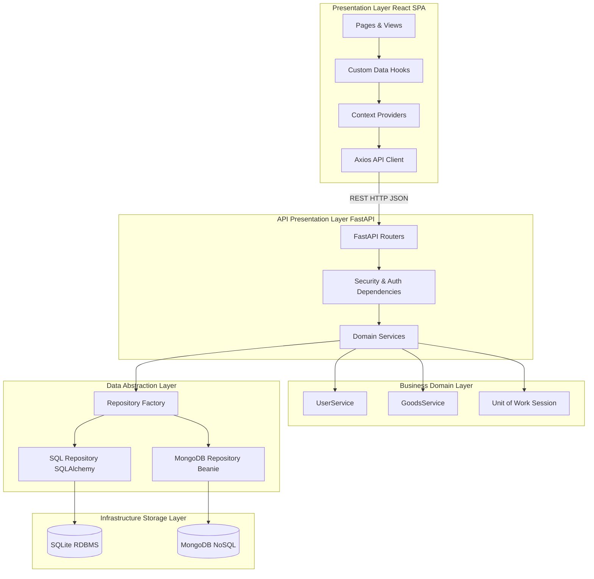
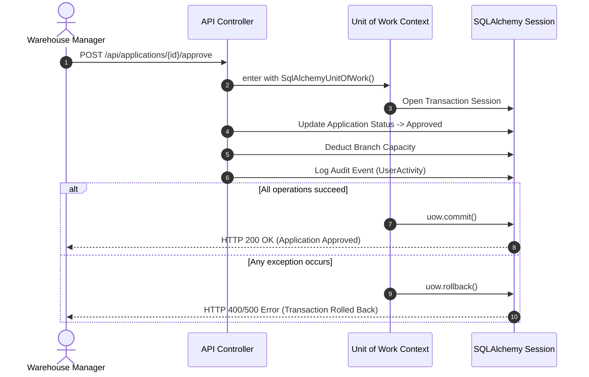

# 🏛️ Architecture & Design Patterns Guide — StockHub

This document provides an enterprise-grade architectural blueprint of **StockHub**, detailing software design patterns, domain boundaries, state management models, and system topology across the stack.

---

## 📋 Table of Contents
1. [Architectural Overview & Principles](#architectural-overview--principles)
2. [System Topology & Component Architecture](#system-topology--component-architecture)
3. [Backend Software Design Patterns](#backend-software-design-patterns)
   - [1. Domain Service Layer Pattern](#1-domain-service-layer-pattern)
   - [2. Unit of Work (UoW) Transaction Pattern](#2-unit-of-work-uow-transaction-pattern)
   - [3. Abstract Repository & Factory Pattern](#3-abstract-repository--factory-pattern)
   - [4. Dependency Injection Authorization Factory](#4-dependency-injection-authorization-factory)
   - [5. Global Exception Handler Middleware](#5-global-exception-handler-middleware)
4. [Frontend Software Design Patterns](#frontend-software-design-patterns)
   - [1. Custom Data Hooks & Reactive State Pattern](#1-custom-data-hooks--reactive-state-pattern)
   - [2. Context Provider State Management](#2-context-provider-state-management)
   - [3. Higher-Order Route Guard Security Pattern](#3-higher-order-route-guard-security-pattern)
   - [4. Service Facade & HTTP Interceptor Pattern](#4-service-facade--http-interceptor-pattern)
5. [Operational SLA, Health & Observability Probes](#operational-sla-health--observability-probes)

---

## Architectural Overview & Principles

StockHub is structured according to **Clean Architecture** and **Domain-Driven Design (DDD)** principles, separating presentation logic, business domains, data access abstractions, and persistent storage layers.



### Core Design Principles
* **Separation of Concerns (SoC)**: Controllers handle HTTP serialization only; domain services encapsulate business logic; repositories handle data access.
* **Dependency Inversion Principle (DIP)**: High-level domain services depend upon abstract repository interfaces (`AbstractUserRepository`), not concrete database drivers.
* **Atomic Transaction Integrity**: Multi-entity modifications use context-managed Unit of Work transactions to prevent partial updates.
* **Fail-Fast Domain Validation**: Input validation and business constraint checks fail before hitting persistence layers.

---

## System Topology & Component Architecture

StockHub decouples the client user interface from the API application backend:

| Component | Technology | Role |
| :--- | :--- | :--- |
| **Frontend SPA** | React 18, Vite, React Router v7, Tailwind CSS | Client rendering, role-based view layout, interactive dashboards. |
| **API Server** | FastAPI, Uvicorn ASGI, Pydantic v2 | High-throughput async RESTful endpoints, JWT authorization, exception handling. |
| **Relational DB** | SQLite / SQLAlchemy ORM | Relational data integrity, foreign key enforcement, optimistic concurrency locks. |
| **Document DB** | MongoDB / Motor & Beanie | Flexible JSON document storage for activity logs and un-structured inventory specs. |

---

## Backend Software Design Patterns

### 1. Domain Service Layer Pattern

* **File Location**: [`backend/app/services/`](file:///Users/jubayerahmedsojib/Documents/GitHub/StockHub/backend/app/services/) (`user_service.py`, `goods_service.py`, `exceptions.py`)
* **Problem Addressed**: Without a Service Layer, API router controllers execute SQL queries, handle business logic, format domain exceptions, and pollute HTTP response logic.
* **Implementation Strategy**:
  Domain operations are encapsulated inside dedicated service classes. API endpoints delegate business execution directly to these services.

```python
class GoodsService:
    def __init__(self, db: Session):
        self.db = db

    def update_stock(self, goods_id: int, quantity_change: int, user_id: int, expected_version: Optional[int] = None):
        item = self.get_goods_item(goods_id)
        
        # Concurrency safety check
        if expected_version is not None and item.version != expected_version:
            raise InsufficientCapacityError(f"Concurrency mismatch for item {goods_id}")

        item.quantity += quantity_change
        item.version = (item.version or 1) + 1
        self.db.commit()
        self.db.refresh(item)
        return item
```

---

### 2. Unit of Work (UoW) Transaction Pattern

* **File Location**: [`backend/app/unit_of_work.py`](file:///Users/jubayerahmedsojib/Documents/GitHub/StockHub/backend/app/unit_of_work.py)
* **Problem Addressed**: Business actions often involve writing to multiple tables (e.g., approving an application, allocating branch capacity, creating inventory, and recording audit logs). Committing individually creates data corruption risks if step 3 fails.
* **Sequence Diagram**:



---

### 3. Abstract Repository & Factory Pattern

* **File Location**: [`backend/app/repositories/`](file:///Users/jubayerahmedsojib/Documents/GitHub/StockHub/backend/app/repositories/) (`user_repository.py`, `factory.py`)
* **Problem Addressed**: Hardcoding database driver logic locks the backend to a single database product.
* **Implementation Strategy**:
  `AbstractUserRepository` defines abstract interface methods (`get_by_id`, `create`, `list`). `RepositoryFactory` selects between `SqlUserRepository` and `MongoUserRepository` dynamically based on system environment parameters (`DB_ENGINE`).

```python
class RepositoryFactory:
    @staticmethod
    def get_user_repository(db: Session, db_type: Optional[str] = None) -> AbstractUserRepository:
        engine_type = db_type or os.getenv("DB_ENGINE", "sqlite")
        if engine_type == "mongodb":
            return MongoUserRepository()
        return SqlUserRepository(db)
```

---

### 4. Dependency Injection Authorization Factory

* **File Location**: [`backend/app/auth_dependencies.py`](file:///Users/jubayerahmedsojib/Documents/GitHub/StockHub/backend/app/auth_dependencies.py)
* **Problem Addressed**: Re-implementing JWT token parsing and role checks across dozens of route functions causes code duplication and security oversight.
* **Implementation Strategy**:
  FastAPI's dependency injection system uses a Function Factory `require_roles(allowed_roles)` to enforce Role-Based Access Control (RBAC) declaratively:

```python
def require_roles(allowed_roles: List[str]):
    def role_checker(current_user = Depends(get_current_user)):
        if current_user.role not in allowed_roles:
            raise UnauthorizedOperationError("Insufficient role permissions")
        return current_user
    return role_checker

require_admin = require_roles(["admin"])
require_employee_or_admin = require_roles(["employee", "admin"])
```

---

### 5. Global Exception Handler Middleware

* **File Location**: [`backend/app/main.py`](file:///Users/jubayerahmedsojib/Documents/GitHub/StockHub/backend/app/main.py#L60-L75)
* **Problem Addressed**: Catching exceptions inside every API router function creates boilerplates and irregular JSON error shapes.
* **Implementation Strategy**:
  Domain services throw pure Python domain exceptions (`EntityNotFoundError`, `InsufficientCapacityError`). The FastAPI global exception handlers translate these domain exceptions into standard RFC 7807 HTTP responses automatically.

---

## Frontend Software Design Patterns

### 1. Custom Data Hooks & Reactive State Pattern

* **File Location**: [`src/hooks/`](file:///Users/jubayerahmedsojib/Documents/GitHub/StockHub/src/hooks/) (`useGoods.js`, `useBranches.js`)
* **Problem Addressed**: Mixing asynchronous network requests, loading spinners, and error state tracking directly inside view components causes bloated, unmaintainable UI code.
* **Implementation Strategy**:
  Custom React Hooks encapsulate API requests and return `{ data, loading, error, refresh }` states reactively.

```javascript
export const useGoods = (filters = {}) => {
  const [goods, setGoods] = useState([]);
  const [loading, setLoading] = useState(true);
  const [error, setError] = useState(null);

  const fetchGoods = useCallback(async () => {
    try {
      setLoading(true);
      const response = await goodsAPI.getAll(filters);
      setGoods(response.data || []);
    } catch (err) {
      setError(err.response?.data?.detail || 'Failed to fetch inventory');
    } finally {
      setLoading(false);
    }
  }, [filters]);

  useEffect(() => { fetchGoods(); }, [fetchGoods]);
  return { goods, loading, error, refresh: fetchGoods };
};
```

---

### 2. Context Provider State Management

* **File Location**: [`src/contexts/`](file:///Users/jubayerahmedsojib/Documents/GitHub/StockHub/src/contexts/) (`AuthContext.jsx`, `NotificationContext.jsx`)
* **Usage**: Provides global authentication state and toast dispatchers down the React component tree without manual prop drilling.

---

### 3. Higher-Order Route Guard Security Pattern

* **File Location**: [`src/components/ProtectedRoute.jsx`](file:///Users/jubayerahmedsojib/Documents/GitHub/StockHub/src/components/ProtectedRoute.jsx)
* **Usage**: Wraps protected view components, validating JWT token presence and matching user roles against route permissions before mounting children.

---

### 4. Service Facade & HTTP Interceptor Pattern

* **File Location**: [`src/services/api.js`](file:///Users/jubayerahmedsojib/Documents/GitHub/StockHub/src/services/api.js)
* **Request Interceptor**: Injects `Authorization: Bearer <token>` into outgoing request headers automatically.
* **Response Interceptor**: Intercepts `401 Unauthorized` responses, clears invalid tokens from storage, and redirects the user to `/login`.

---

## Operational SLA, Health & Observability Probes

StockHub exposes standard Kubernetes cloud-native health probes:

* **Liveness Probe** (`/healthz` or `/api/health`): Returns `HTTP 200 OK` if the Python Uvicorn process is active.
* **Readiness Probe** (`/readyz`): Evaluates DB pool connectivity and environment readiness before routing cluster traffic.

---
