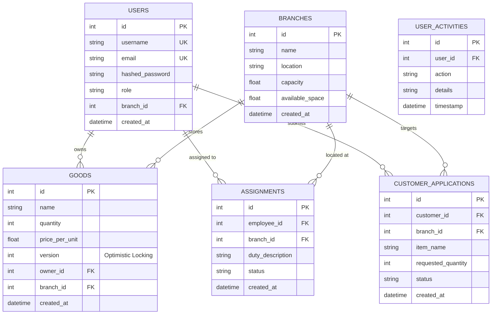
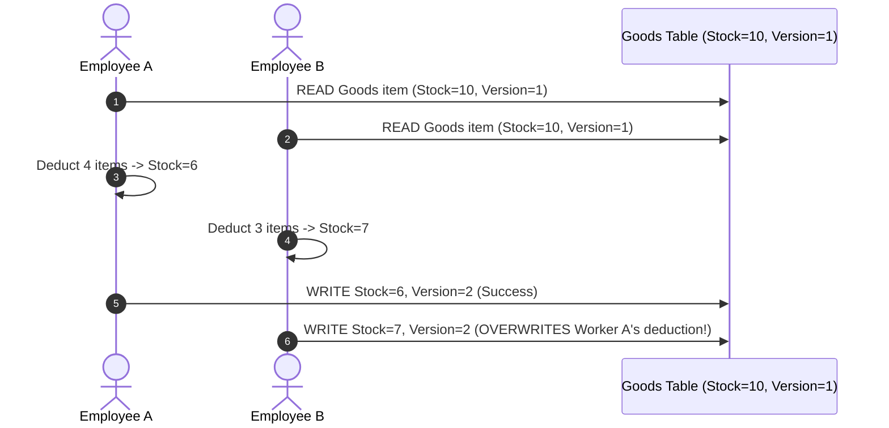

# ⚡ Concurrency & Database Design Guide — StockHub

This document explains the database schema design, multi-database architecture (SQLite/MongoDB), optimistic concurrency control mechanics, and data migration standards implemented in **StockHub**.

---

## 📋 Table of Contents
1. [Database Schema & ER Diagram](#database-schema--er-diagram)
2. [Optimistic Concurrency Locking Mechanics](#optimistic-concurrency-locking-mechanics)
3. [Multi-Database Hybrid Strategy (RDBMS & NoSQL)](#multi-database-hybrid-strategy-rdbms--nosql)
4. [Schema Evolution & Migration Runbook](#schema-evolution--migration-runbook)

---

## Database Schema & ER Diagram

StockHub's primary relational database schema is managed via SQLAlchemy ORM in [`backend/app/database.py`](file:///Users/jubayerahmedsojib/Documents/GitHub/StockHub/backend/app/database.py).



---

## Optimistic Concurrency Locking Mechanics

### The Lost Update Problem
In warehouse inventory management, concurrent stock adjustments create race conditions:



---

### The Solution: Version Column Verification
StockHub prevents lost updates by appending an integer `version` field to inventory entities ([`database.py`](file:///Users/jubayerahmedsojib/Documents/GitHub/StockHub/backend/app/database.py)):

* **Schema Definition**: `version = Column(Integer, default=1, nullable=False)`
* **Service Execution Logic**: [`GoodsService.update_stock()`](file:///Users/jubayerahmedsojib/Documents/GitHub/StockHub/backend/app/services/goods_service.py)

```python
def update_stock(self, goods_id: int, quantity_change: int, user_id: int, expected_version: Optional[int] = None):
    item = self.get_goods_item(goods_id)

    # Concurrency verification step
    if expected_version is not None and item.version != expected_version:
        raise InsufficientCapacityError(
            f"Concurrency conflict: Item version updated by another session. Current: {item.version}, Provided: {expected_version}"
        )

    item.quantity += quantity_change
    item.version = (item.version or 1) + 1  # Atomic increment
    self.db.commit()
    self.db.refresh(item)
    return item
```

---

## Multi-Database Hybrid Strategy (RDBMS & NoSQL)

StockHub supports a hybrid multi-database backend pattern:

1. **Relational Engine (SQLite / PostgreSQL)**: Handles core domain models requiring strict foreign key constraints, atomic transactions, and relational queries (`backend/app/database.py`).
2. **Document Engine (MongoDB / Motor & Beanie)**: Handles high-velocity audit activity logging and unstructured payload storage (`backend/app/mongodb.py` & `mongo_models.py`).

The **Repository Factory Pattern** ([`backend/app/repositories/factory.py`](file:///Users/jubayerahmedsojib/Documents/GitHub/StockHub/backend/app/repositories/factory.py)) provides an abstraction layer so API services call a uniform data interface regardless of database engine.

---

## Schema Evolution & Migration Runbook

Database lifecycle management scripts reside under [`backend/scripts/`](file:///Users/jubayerahmedsojib/Documents/GitHub/StockHub/backend/scripts/):

* `migrate_database.py`: Executes relational schema column alterations on SQLite.
* `migrate_to_mongodb.py`: Synchronizes relational records into MongoDB collections for document operations.
* `seed_data.py`: Seeds initial admin accounts, default warehouse branches, and sample inventory data.

---
