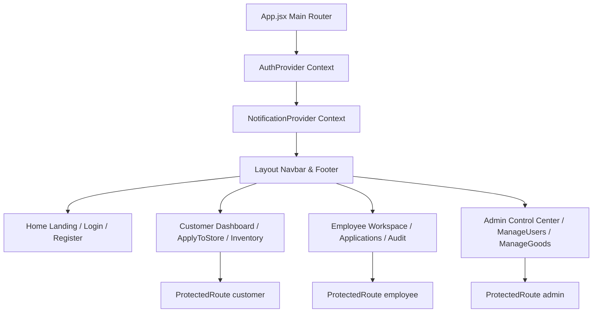
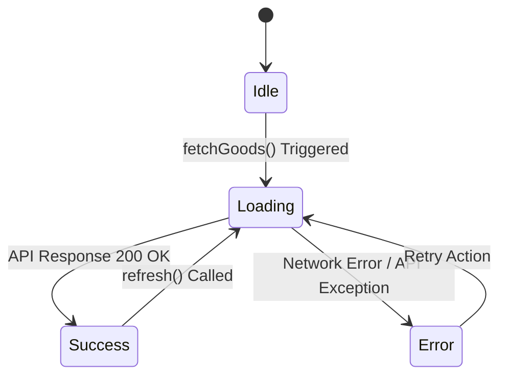

# 🎨 Frontend Architecture & Hooks Guide — StockHub

This document explains the frontend component architecture, state management models, React custom hooks, route guards, and API network integration patterns in **StockHub**.

---

## 📋 Table of Contents
1. [Frontend Overview & Component Topology](#frontend-overview--component-topology)
2. [State Management & Context Providers](#state-management--context-providers)
3. [Custom Data Hooks & State Machines](#custom-data-hooks--state-machines)
4. [Route Security & UI Access Control](#route-security--ui-access-control)
5. [API Service Facade & HTTP Interceptors](#api-service-facade--http-interceptors)
6. [UI Performance & Error Handling Best Practices](#ui-performance--error-handling-best-practices)

---

## Frontend Overview & Component Topology

StockHub's user interface is a responsive Single Page Application (SPA) built using **React 18**, **Vite**, **React Router v7**, **Tailwind CSS**, and **Framer Motion**.



### Component Structure
```text
src/
├── App.jsx                     # Top-Level Router Container
├── main.jsx                    # Application Entry Point
├── contexts/                   # Global React Contexts
│   ├── AuthContext.jsx         # Authentication & JWT Storage State
│   └── NotificationContext.jsx # Toast Banner Notification System
├── hooks/                      # Custom Data & Behavior Hooks
│   ├── useGoods.js             # Inventory Fetching & Refresh Hook
│   ├── useBranches.js          # Branch Listing & Capacity Hook
│   └── useSmoothScroll.js      # Smooth Scroll Behavioral Hook
├── components/
│   ├── admin/                  # Admin Components & Modals
│   ├── common/                 # Shared UI Components & Toast Banners
│   ├── customer/               # Customer Dashboard Widgets
│   └── layout/                 # Main Navbar & Footer Components
└── services/                   # Axios API Network Facade
    └── api.js                  # Request/Response Interceptors
```

---

## State Management & Context Providers

### 1. `AuthContext` (`src/contexts/AuthContext.jsx`)
* **Role**: Manages persistent user authentication identity, JWT access/refresh token storage (`localStorage`), login authentication, and logout cleanup.
* **Usage Example**:
```javascript
import { useAuth } from '../contexts/AuthContext';

const DashboardHeader = () => {
  const { user, logout } = useAuth();
  return (
    <header className="flex justify-between items-center p-4">
      <h2>Welcome, {user?.username} ({user?.role})</h2>
      <button onClick={logout} className="btn-danger">Logout</button>
    </header>
  );
};
```

### 2. `NotificationContext` (`src/contexts/NotificationContext.jsx`)
* **Role**: Provides a centralized toast notification dispatcher (`showSuccess`, `showError`, `showWarning`, `showInfo`) rendering animated notifications globally.

---

## Custom Data Hooks & State Machines

StockHub uses Custom React Hooks to extract asynchronous network state management out of view components.



### Hook Specification: `useGoods(filters)`
```javascript
import { useState, useEffect, useCallback } from 'react';
import { goodsAPI } from '../services/api';

export const useGoods = (filters = {}) => {
  const [goods, setGoods] = useState([]);
  const [loading, setLoading] = useState(true);
  const [error, setError] = useState(null);

  const fetchGoods = useCallback(async () => {
    try {
      setLoading(true);
      const response = await goodsAPI.getAll(filters);
      setGoods(response.data || []);
    } catch (err) {
      setError(err.response?.data?.detail || 'Failed to retrieve inventory.');
    } finally {
      setLoading(false);
    }
  }, [filters]);

  useEffect(() => {
    fetchGoods();
  }, [fetchGoods]);

  return { goods, loading, error, refresh: fetchGoods };
};
```

---

## Route Security & UI Access Control

* **Component**: [`src/components/ProtectedRoute.jsx`](file:///Users/jubayerahmedsojib/Documents/GitHub/StockHub/src/components/ProtectedRoute.jsx)
* **Logic**: Intercepts navigation actions, verifying that:
  1. The user is logged in (`isAuthenticated`).
  2. The user's role matches `allowedRoles`.
  If unauthorized, the user is redirected to `/login` with location memory.

```jsx
<Route 
  path="/admin/manage-users" 
  element={
    <ProtectedRoute allowedRoles={['admin']}>
      <ManageUsers />
    </ProtectedRoute>
  } 
/>
```

---

## API Service Facade & HTTP Interceptors

* **File**: [`src/services/api.js`](file:///Users/jubayerahmedsojib/Documents/GitHub/StockHub/src/services/api.js)
* **Axios Configuration**:
  * **Base URL Integration**: Dynamically reads `import.meta.env.VITE_API_BASE_URL` or defaults to `http://localhost:8000`.
  * **Request Interceptor**: Automatically attaches `Authorization: Bearer <access_token>` to every request header.
  * **Response Interceptor**: Automatically captures `401 Unauthorized` responses, clears local storage tokens, and redirects the client browser to `/login`.

---

## UI Performance & Error Handling Best Practices

1. **Memoized Handlers**: Callbacks inside data hooks use `useCallback` to prevent unnecessary component re-renders.
2. **Accessible Form Controls**: Standardized inputs feature accessible visual focus states and ARIA labels.
3. **Graceful Loading Skeletons**: View components render pulse loading skeletons while `loading === true` to avoid layout shifts.

---
