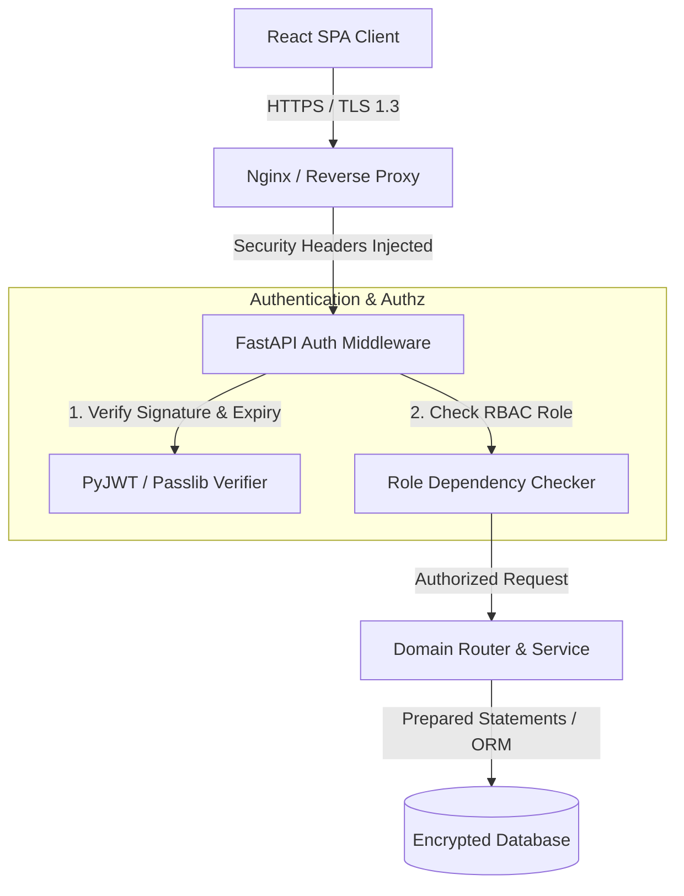
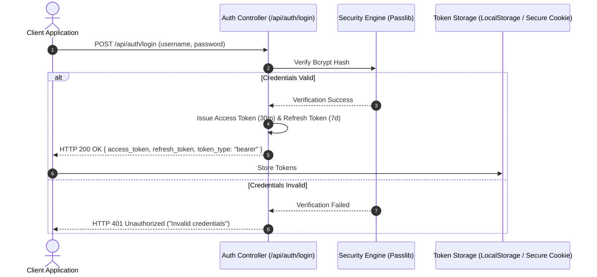

# 🔒 Security & Authentication Architecture — StockHub

This document outlines the security architecture, cryptography standards, token authentication flows, Role-Based Access Control (RBAC) rules, and OWASP security mitigations implemented in **StockHub**.

---

## 📋 Table of Contents
1. [Security Architecture Overview](#security-architecture-overview)
2. [JWT OAuth2 Dual Token Authentication Flow](#jwt-oauth2-dual-token-authentication-flow)
3. [Token Refresh & Rotation Protocol](#token-refresh--rotation-protocol)
4. [Cryptographic Password Standards](#cryptographic-password-standards)
5. [Role-Based Access Control (RBAC) Matrix](#role-based-access-control-rbac-matrix)
6. [Security Response Headers & CORS Policy](#security-response-headers--cors-policy)
7. [OWASP Top 10 Threat Mitigation Matrix](#owasp-top-10-threat-mitigation-matrix)

---

## Security Architecture Overview

StockHub implements a **defense-in-depth security model** protecting sensitive warehouse inventory data and enterprise operations.



---

## JWT OAuth2 Dual Token Authentication Flow

StockHub utilizes stateless **JSON Web Tokens (JWT)** signed via HMAC SHA-256 (`HS256`).



---

## Token Refresh & Rotation Protocol

To prevent session dropouts while keeping access tokens short-lived:

* **Access Token**:
  * **Lifespan**: 30 Minutes (`ACCESS_TOKEN_EXPIRE_MINUTES = 30`)
  * **Payload Structure**:
    ```json
    {
      "sub": "johndoe",
      "user_id": 42,
      "role": "employee",
      "type": "access",
      "exp": 1721865600
    }
    ```
* **Refresh Token**:
  * **Lifespan**: 7 Days (`REFRESH_TOKEN_EXPIRE_DAYS = 7`)
  * **Endpoint**: `POST /api/auth/refresh`
  * **Behavior**: Used strictly to obtain a new Access Token without re-entering credentials.

---

## Cryptographic Password Standards

* **Algorithm**: `bcrypt` via Passlib (`CryptContext(schemes=["bcrypt"])`).
* **Salt Management**: Automated unique per-password salt generation handled by bcrypt.
* **Storage Standard**: Raw passwords are **never** logged or persisted. Only salted bcrypt hashes (`hashed_password`) exist in database tables.

```python
pwd_context = CryptContext(schemes=["bcrypt"], deprecated="auto")

def get_password_hash(password: str) -> str:
    return pwd_context.hash(password)

def verify_password(plain_password: str, hashed_password: str) -> bool:
    return pwd_context.verify(plain_password, hashed_password)
```

---

## Role-Based Access Control (RBAC) Matrix

StockHub enforces strict 3-tier authorization boundaries across endpoints and UI components:

| Feature / Resource | Customer Role | Employee Role | Admin Role |
| :--- | :---: | :---: | :---: |
| **View Personal Stored Goods** | ✅ | ✅ | ✅ |
| **Submit Application (`ApplyToStore`)** | ✅ | ❌ | ✅ |
| **Inspect Branch Capacity Metrics** | ✅ | ✅ | ✅ |
| **Process Customer Applications** | ❌ | ✅ | ✅ |
| **Audit Branch Inventory Stock** | ❌ | ✅ | ✅ |
| **Log Work Duty Time Tracker** | ❌ | ✅ | ✅ |
| **Full Inventory CRUD & Stock Updates** | ❌ | ❌ | ✅ |
| **Provision & Delete Branches** | ❌ | ❌ | ✅ |
| **User & Role Administration** | ❌ | ❌ | ✅ |

---

## Security Response Headers & CORS Policy

StockHub enforces browser-level security headers via FastAPI middleware and Nginx configuration:

* `X-Content-Type-Options: nosniff`: Prevents MIME-type sniffing attacks.
* `X-Frame-Options: DENY`: Protects against Clickjacking framing attacks.
* `X-XSS-Protection: 1; mode=block`: Activates cross-site scripting filters.
* `Strict-Transport-Security: max-age=31536000`: Forces HTTPS connections.
* **CORS Restraints**: Restricts API calls strictly to approved web origins (`settings.CORS_ORIGINS`).

---

## OWASP Top 10 Threat Mitigation Matrix

| OWASP Risk | StockHub Technical Mitigation |
| :--- | :--- |
| **A01: Broken Access Control** | Enforced via declarative dependency injection (`require_roles(["admin"])`) on every API route. |
| **A02: Cryptographic Failures** | Passlib `bcrypt` password hashing + HS256 JWT signature verification. |
| **A03: Injection (SQL / NoSQL)** | Parametric query execution via SQLAlchemy ORM & Beanie ODM; no raw SQL concatenations. |
| **A04: Insecure Design** | Unit of Work transactional atomicity and domain exception translation. |
| **A05: Security Misconfiguration** | Strongly typed Pydantic `BaseSettings` reading environment parameters safely. |
| **A07: Identification & Auth Failures**| Short-lived 30-min access tokens paired with refresh token rotation. |

---
